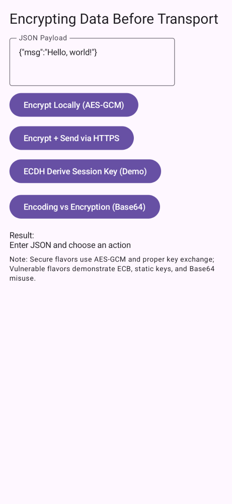
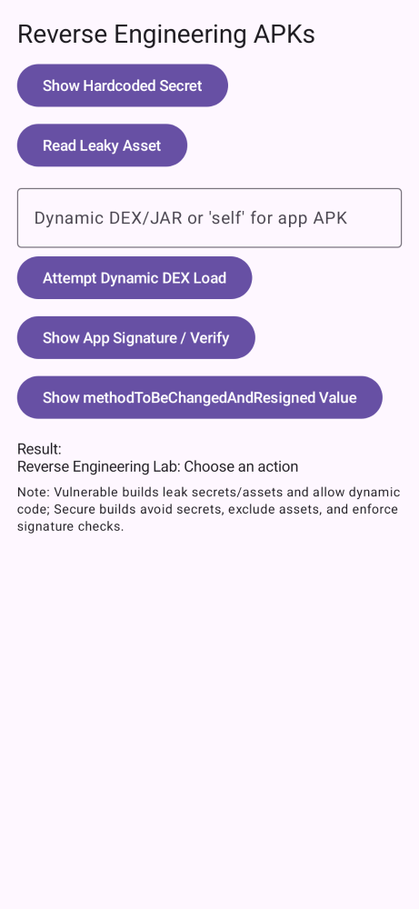
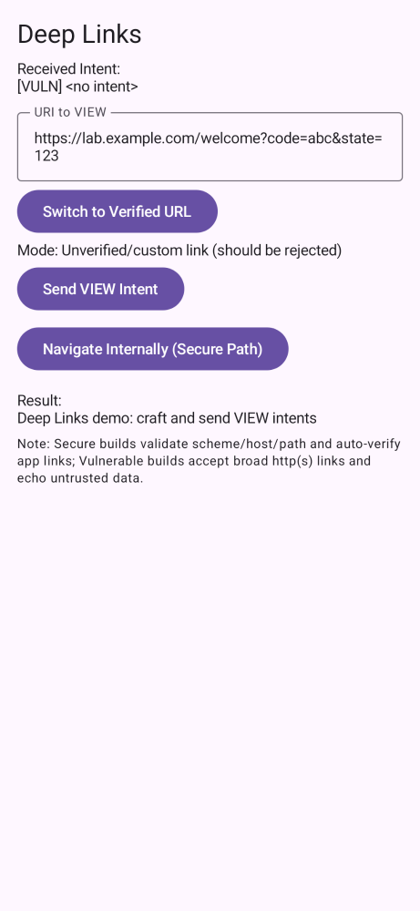
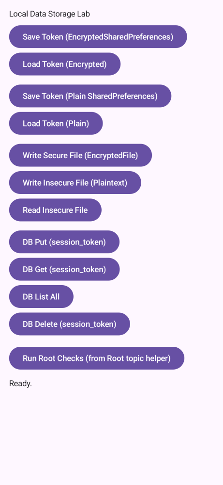
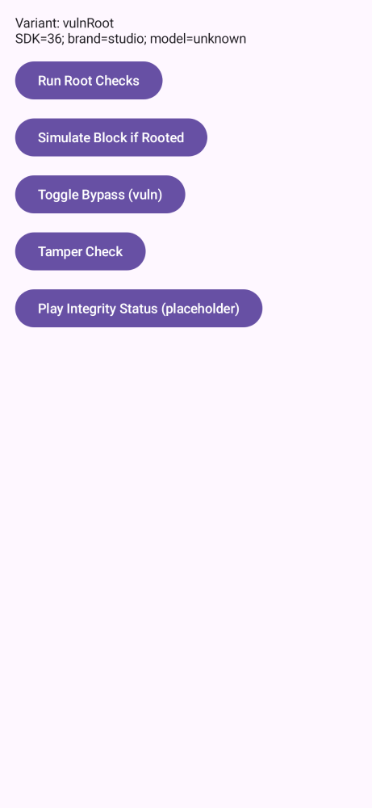
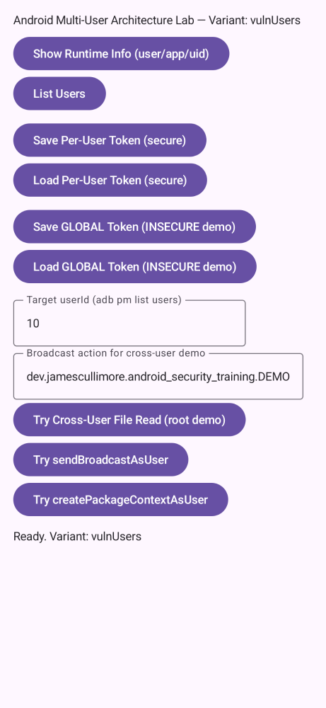
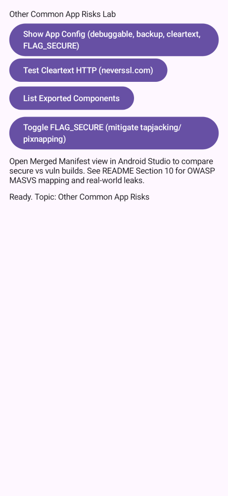

# Android Security Training

Learn Android security through hands-on labs with parallel secure and vulnerable implementations for each topic. This project covers 10 key security areas, each provided in two flavors: a best-practice secure build and a deliberately vulnerable build to illustrate common pitfalls.

    
    

## Table of contents
- [Purpose and scope](#purpose-and-scope)
- [Prerequisites (tools) and before‑you‑start](#prerequisites-tools-and-beforeyoustart-steps)
- [Quick start](#quick-start)
- [Build variants (how this project is organized)](#build-variants-how-this-project-is-organized)
- [Topics: how to run the labs (index)](docs/topics/README.md)
  - [1. Certificate pinning & HTTPS](docs/topics/pinning/README.md)
  - [2. End‑to‑end encryption (E2E)](docs/topics/e2e/README.md)
  - [3. Reverse‑engineering resistance](docs/topics/re/README.md)
  - [4. Runtime permissions](docs/topics/perm/README.md)
  - [5. App links & deep links](docs/topics/links/README.md)
  - [6. Secure storage](docs/topics/storage/README.md)
  - [7. Root/Jailbreak detection](docs/topics/root/README.md)
  - [8. WebView & exported components](docs/topics/web/README.md)
  - [9. Multi‑user/AAOS considerations](docs/topics/users/README.md)
  - [10. Risk modeling & dangerous defaults](docs/topics/risks/README.md)
- [MITM proxy quick setup (mitmproxy + emulator)](docs/howtos/mitmproxy.md)
- [Getting a rooted emulator](docs/howtos/rooted-emulator.md)
- [Frida](docs/howtos/frida.md)
- [Troubleshooting](#troubleshooting)

## Purpose and scope
- Goal: Help Android developers learn modern security practices through code you can run, inspect, and modify.
- How: Build one topic at a time and toggle secure vs. vulnerable behavior. Use a proxy or other tools to observe differences.
- Outcome: Understand why attacks work against the vulnerable build and how the secure build stops them.

## Prerequisites (tools) and before‑you‑start steps
- Android Studio (latest stable) with Android SDK and emulator images installed.
- Java 21 toolchain (Gradle wrapper config uses JDK 21 compatibility).
- A device or emulator. For interception/root labs, prefer an emulator you control (see rooted emulator section).
- Optional but recommended for labs:
  - mitmproxy, Burp Suite, or OWASP ZAP
  - Wireshark or tcpdump
  - jadx, jadx‐gui and apktool installed
  - DB Browser for SQLite (to inspect pulled SQLite .db files) https://sqlitebrowser.org/
  - (optional) [Frida](docs/howtos/frida.md) 
  - sqlite3 CLI (alternative) — download from https://www.sqlite.org/download.html
- Before you start:
  1) Clone this repo and open it in Android Studio.
  2) Let Gradle sync and index completely.
  3) Decide which topic you want to run first (see Build variants), then pick a secure or vuln profile.
  4) If you plan to demo MITM, configure your proxy and device/emulator networking first.

## Quick start
1) Open the project in Android Studio (latest stable).
2) In Build Variants, choose a pair like `vulnPinning` (to see the issue) then `securePinning` (to see the fix).
3) Run on an emulator or device and follow the on‑screen actions for the selected topic.
4) For network labs, configure your proxy before launching the vulnerable build.

## Build variants (how this project is organized)
- Two flavor dimensions in `app/build.gradle.kts`:
  - securityProfile: `secure` (best practices) or `vuln` (intentionally unsafe). Release builds are disabled for `vuln`.
  - topic: `pinning`, `e2e`, `re`, `perm`, `links`, `storage`, `root`, `web`, `users`, `risks`.
- The final build variant is `<securityProfile><Topic>`, for example:
  - `securePinning`, `vulnPinning`
  - `secureWeb`, `vulnWeb`, etc.
- Routing is handled by per‑flavor providers so the right helper is compiled for each variant.

## Troubleshooting
- Build with the Gradle wrapper from Android Studio. If secure pinning fails, check device time and that pins match the current server keys.
- Deep links require a matching `assetlinks.json` on your domain. Update host/path if you change it.
- For MITM demos, remember: secure flavors do not trust user CAs; use vuln flavors.
- If the emulator won’t run as root, confirm you didn’t pick a Google Play image (see section above).
- Expect‑CT (legacy): https://developer.mozilla.org/en-US/docs/Web/HTTP/Headers/Expect-CT