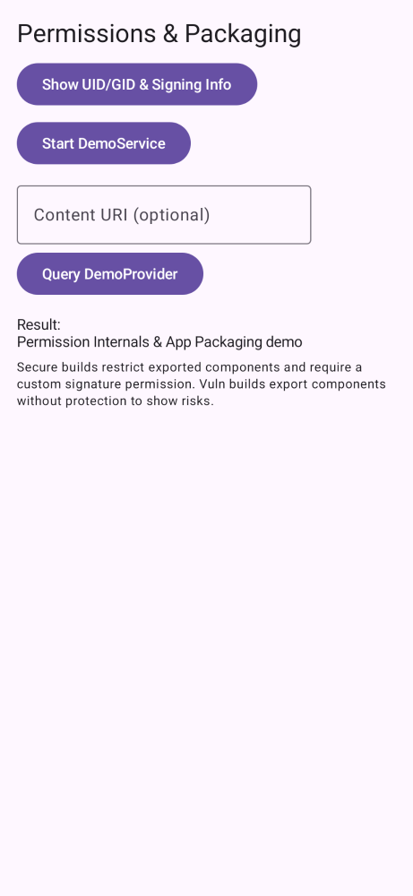

# 4. Runtime permissions



#### Where in code
- Topic activity: `app/src/perm/java/.../PermActivity.kt`
- Interface: `app/src/main/java/.../perm/PermDemoHelper.kt`
- Vulnerable helper: `app/src/vuln/java/.../perm/VulnPermDemoHelper.kt`
- Secure helper: `app/src/secure/java/.../perm/SecurePermDemoHelper.kt`
- Topic manifest: `app/src/perm/AndroidManifest.xml`

#### What this lab demonstrates
- How Android assigns UIDs/GIDs and ties permissions to app signatures (not package names)
- Risks of exported components without protection (Service/Provider)
- Using a custom signature permission to restrict cross‑app access

#### Build the variants
- Vulnerable (debug):
  ```
  ./gradlew :app:assembleClientVulnPermDebug
  ```
- Secure (debug):
  ```
  ./gradlew :app:assembleClientSecurePermDebug
  ```

#### In‑app steps (PermActivity)
1) Launch the app. You’ll see the Permissions & Packaging screen.
2) Tap “Show UID/GID & Signing Info”
   - Vulnerable: minimal info (no digest)
   - Secure: shows Base64 SHA‑256 signer digest computed at runtime
3) Tap “Start DemoService”
   - Vulnerable: Often succeeds even for external callers if the Service is exported without protection
   - Secure: Designed to be restricted; external calls should fail unless signed with the same key (signature permission)
4) Optionally, enter a Content URI or use the default and tap “Query DemoProvider”
   - Vulnerable: Provider likely exported without protection; query may succeed
   - Secure: Provider should enforce a signature permission and/or not be exported; query should fail for untrusted callers

#### Cross‑app/adb checks (optional, to prove enforcement)
- Find the installed package names:
  ```
  adb shell pm list packages | grep android_security_training
  ```
- Inspect merged manifest and exported state:
  ```
  adb shell dumpsys package dev.jamescullimore.android_security_training.secure | sed -n '1,160p'
  adb shell dumpsys package dev.jamescullimore.android_security_training.vuln | sed -n '1,160p'
  ```
- Try to query the provider from shell (acts as shell UID, not the app):
  ```
  adb shell content query --uri content://dev.jamescullimore.android_security_training.vuln.demo/hello
  ```
  Replace `<package>` with the running variant package (secure or vuln). Expect secure to deny.
- Try to start the service from shell:
  ```
  adb shell am startservice -n <package>/dev.jamescullimore.android_security_training.perm.DemoService
  ```
  Expect secure to deny or require matching signature; vuln may start.

#### Deliverables (for workshops)
- Screenshot of secure vs vuln behavior for Service/Provider attempts
- Short note of what protection stopped access in secure (e.g., signature permission)

#### Troubleshooting
- If `INSTALL_FAILED_UPDATE_INCOMPATIBLE`, uninstall first:
  ```
  adb uninstall dev.jamescullimore.android_security_training.secure
  adb uninstall dev.jamescullimore.android_security_training.vuln
  ```
- If provider queries return null in secure: that’s expected when protected; verify logs for `SecurityException`
- If buttons do nothing, ensure you built the `perm` topic variants and that `PermActivity` is the launcher (topic manifest provides it)

#### Best practices
- Request the minimum set, at time‑of‑use; provide clear rationale.
- Avoid exporting components unless necessary; use signature or signatureOrSystem for intra‑suite IPC.
- Prefer explicit intents for internal services and require permissions for any exported components.
- Avoid legacy storage permissions by using scoped storage and intents.

#### Extra reading
- Request app permissions: https://developer.android.com/training/permissions/requesting
- Best practices for permissions: https://developer.android.com/training/permissions/usage
- Data minimization: https://developer.android.com/topic/security/best-practices#data-min
- MASVS‑PLATFORM: https://mas.owasp.org/MASVS/
