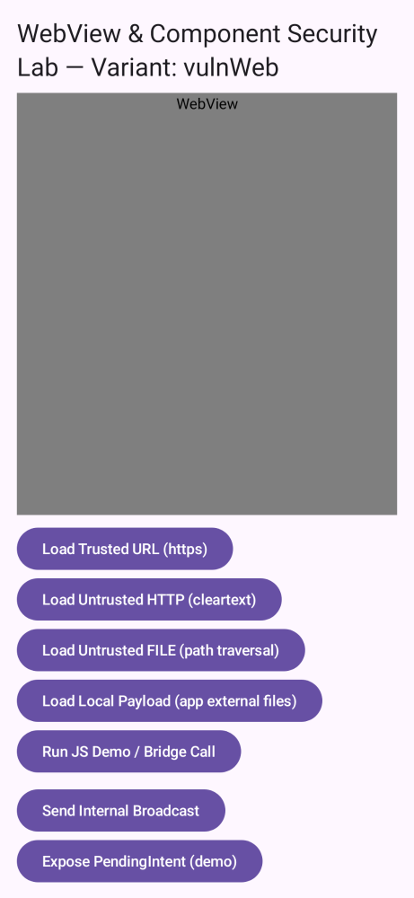

# 8. WebView & exported components



#### Where in code
  - Topic activity: `app/src/web/java/.../WebActivity.kt`
  - Secure helper/receiver: `app/src/secure/java/.../web/SecureWebViewHelper.kt`
  - Vulnerable helper: `app/src/vuln/java/.../web/VulnWebViewHelper.kt`
  - Demo ContentProvider (class): `app/src/main/java/.../perm/DemoProvider.kt` (authority overridden in vuln manifest)
  - Vulnerable manifest override: `app/src/vuln/AndroidManifest.xml` (exported provider authority `com.example.demo.provider`)

#### Lab guide (hands-on)
A) Exported ContentProvider attack (adb)
- Build and run `vulnPermDebug` or any vuln topic (provider is registered in the vuln manifest).
- Query the exported provider from the shell:
  ```
  adb shell content query --uri content://dev.jamescullimore.android_security_training.vuln.demo/hello
  ```
  Expected (vuln): a row like `hello from DemoProvider: /hello` because the provider is exported with no permission checks.

- Compare with secure builds: the same provider is non-exported and gated by a signature permission; external queries should fail.

B) WebView path traversal from file scheme (vuln)
- Build and run `vulnWebDebug` and open the WebView screen.
- Tap "Configure WebView" (enables JS, file://, mixed content, etc. in vuln).
- Tap "Load Untrusted HTTP (cleartext)" to demonstrate mixed content and lack of validation (loads http://neverssl.com/).
- Tap "Load Untrusted FILE (path traversal)" to execute a traversal load. The vuln helper prepares a secret at:
  - `/data/data/<pkg>/files/secret.txt` (created on first run)
- It then calls:
  ```
  webView.loadUrl("file:///android_asset/../../data/data/<pkg>/files/secret.txt")
  ```
  Notes:
  - Modern WebView implementations may block this traversal, but the code and attempt are visible for discussion and testing on older images.
  - Replace `<pkg>` with the running package, e.g., `dev.jamescullimore.android_security_training.vuln`.

C) Resetting app data via broadcast (lab helper)
For quick lab resets, the app includes a BroadcastReceiver that can clear local data.
- Action: `dev.jamescullimore.android_security_training.ACTION_CLEAR_DATA`
- Extras:
  - `what` (optional): one of `prefs`, `files`, `cache`, `db`/`databases`, or omit for `all`.

Usage examples (vulnerable flavors expose this receiver; secure flavors keep it non-exported and gated by a signature permission):
- Vulnerable build (any topic, package suffix `.vuln`):
  ```
  # Clear everything (prefs, files, cache, databases)
  adb shell am broadcast -a dev.jamescullimore.android_security_training.ACTION_CLEAR_DATA -n dev.jamescullimore.android_security_training.vuln/dev.jamescullimore.android_security_training.ClearDataReceiver

  # Clear only SharedPreferences
  adb shell am broadcast -a dev.jamescullimore.android_security_training.ACTION_CLEAR_DATA --es what prefs -n dev.jamescullimore.android_security_training.vuln/dev.jamescullimore.android_security_training.ClearDataReceiver
  ```
- Secure build: The receiver is not exported and requires the custom signature permission, so external adb broadcasts will be ignored/denied by design. Triggering is possible only from inside the app or a same-signature test app.

D) Load a malicious HTML payload (local file and via adb VIEW)
- Place the payload into the app-specific external files directory (works without storage permissions on modern Android):
  ```
  # For the vulnerable package id
  adb shell mkdir -p /sdcard/Android/data/dev.jamescullimore.android_security_training.vuln/files
  adb push html/payload.html /sdcard/Android/data/dev.jamescullimore.android_security_training.vuln/files/payload.html
  ```
- In the app (vulnWebDebug):
  1) Tap "Configure WebView".
  2) Tap "Load Local Payload (app external files)" — this loads `file:///sdcard/Android/data/dev.jamescullimore.android_security_training.vuln/files/payload.html`.
- Or trigger via adb with a VIEW intent (deep link to a file URL):
  ```
  adb shell am start -n dev.jamescullimore.android_security_training.vuln/dev.jamescullimore.android_security_training.WebActivity -a android.intent.action.VIEW -d "file:///sdcard/Android/data/dev.jamescullimore.android_security_training.vuln/files/payload.html"
  ```
  - WebActivity has an intent-filter for `file`, `http`, and `https` and will auto-load the provided URI into the WebView on launch.
  - Tip: You can also host the file and use `-d "http://10.0.2.2:8000/payload.html"` to demo from the host machine.

E) Other vuln WebView demos
- Run JS demo to exfiltrate a token from `addJavascriptInterface` and observe the broadcast.
- Expose/trigger a mutable PendingIntent via broadcast leak.

#### Best practices
  - Disable JS, file access, and mixed content by default.
  - Use a safe URL loading policy and validate origins.
  - Don’t expose WebView JS interfaces to untrusted content; prefer postMessage‑style bridges with strict validation.
  - Avoid exporting components unless required; protect with signature permissions when needed.

#### Extra reading
  - WebView security tips: https://developer.android.com/guide/webapps/webview#security
  - Avoiding intent/component leaks: https://developer.android.com/guide/components/intents-filters#Security
  - Network security config (mixed content): https://developer.android.com/training/articles/security-config#CleartextTrafficPermitted
  - MASVS‑PLATFORM: https://mas.owasp.org/MASVS/
